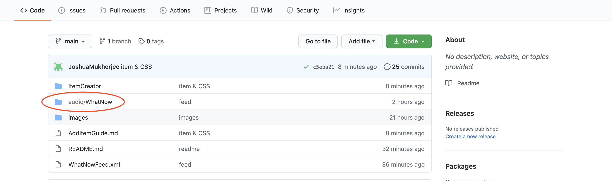
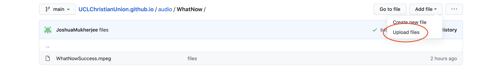
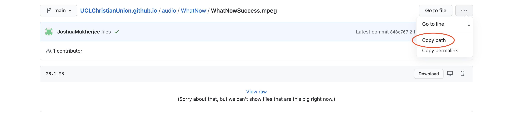
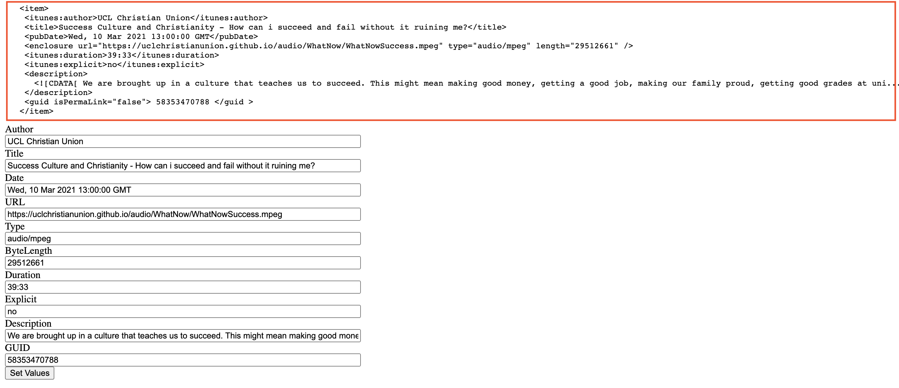
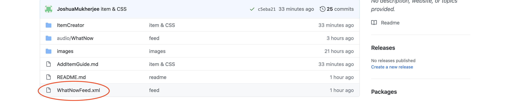
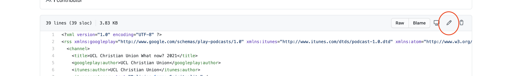
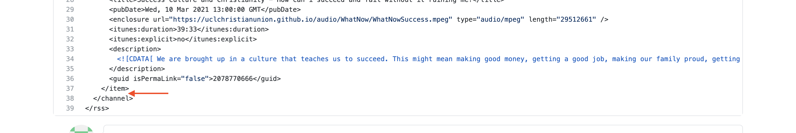

# Adding An Episode To a Podcast

To add an episode to a podcast we need to add it to the rss file for that podcast. An rss file is a file in the xml format (what that means isnt important but its a way of defining data with tags like this \<tag\> and closed like this \</tag\>). 

For now i will assume we have an xml file for the podcast - i may add a tool for this later

Within the xml file we have a set of tags. To add a new episode we need to add another set of \<item\> tags. This will contain all the information for our episode. First we need to upload the audio file into the github. 

1. On the github online client (https://github.com/UCLChristianUnion/UCLChristianUnion.github.io) navigate into the folder containing your podcasts audio files. eg audio/WhatNow for the 2021 mission week files

   

2. Then click on the top right 'Add File' then click 'Upload files' and upload your file

   

3. Click on the file you have uploaded and then click copy path. The link to the file will be https://uclchristianunion.github.io/{What you copied} eg https://uclchristianunion.github.io/audio/WhatNow/WhatNowSuccess.mpeg . <b> You will need the link for your file you uploaded </b>

   

4. Now we need to create the \<item\> tag for the xml file. Go to this link: https://uclchristianunion.github.io/ItemCreator/ItemCreator.html. You should then be able to fill in the boxes. 

   - Author: Name of the author - default "UCL Christian Union" you can leave it as that or you can change it
   - Title: The title of the talk eg "Success Culture and Christianity - How can i succeed and fail without it ruining me?"
   - Date: Must be in the format 'day-of-the-week, day month year time time-zone' This should be autofilled. Eg "Wed, 10 Mar 2021 13:00:00 GMT"
   - URL: the URL we obtained in step 3. Make sure you also include the https://uclchristianunion.github.io/ part eg "https://uclchristianunion.github.io/audio/WhatNow/WhatNowSuccess.mpeg"
   - Type: the file type eg "audio/mpeg"
   - ByteLength: the length of the file in bytes. On your computer you should be able to see this information in your files- press command-I on a Mac and its size under general (remove the commas). On windows you should be able see it in file explorer in the size column.  Eg "29512661"
   - Duration: the length of the audio in the format minutes:seconds eg "39:33"
   - Explicit: is it explicit, probably not so autofilled no eg "no"
   - Description: the description of the talk. You should be able to use HTML to make links etc in this if you know how and want to do that eg 
     - "We are brought up in a culture that teaches us to succeed. This might mean making good money, getting a good job, making our family proud, getting good grades at uni... So we strive to achieve them. But you feel like an imposter, everyone around you seems better than you are. You’re told to work harder, that a bit more success will make you feel better. But it never does… There's always more, it's overwhelming, the fear of failure, the feeling of insignificance. So… what now? Events week is a series of talks organized by the UCL Christian Union, around 40min each, and this year we are exploring the theme of "What now?". We are very excited to have Peter Dray from UCCF speak to us on the first topic "Success Culture and Christianity - How Can I Succeed And Fail Without It Ruining Me?"\ \ ---\ \ Check out our social media to stay up to date with future events: \ Facebook: \<a href="https://www.facebook.com/uclcu" rel="noopener">https://www.facebook.com/uclcu</a>/\ \ Instagram: \<a href="https://www.instagram.com/ucl.cu/" rel="noopener">https://www.instagram.com/ucl.cu/\</a>"
   - GUID: This is a random id for the podcast, probably don't change this from what its autofilled but you can

5. Now press "Set values". This should fill in the text at the top of the page. IT may not look exactly like this but the boxes should be the same:

   

6. Copy the text at the top from the \<item> to the \</item> (highlighted in red) we will need to put this in the xml file. Find the feed for your podcast eg WhatNowFeed.xml and open it

   

7. Click edit this file (the pencil) in the top right

   

8. Scroll to the very bottom of the page. Paste the stuff you copied in step 6 <b> below </b> the last \</item> tag in the file and **before** the \</channel> tag. 

   

9. Scroll down to the bottom and then press "Commit Changes". It should work!

